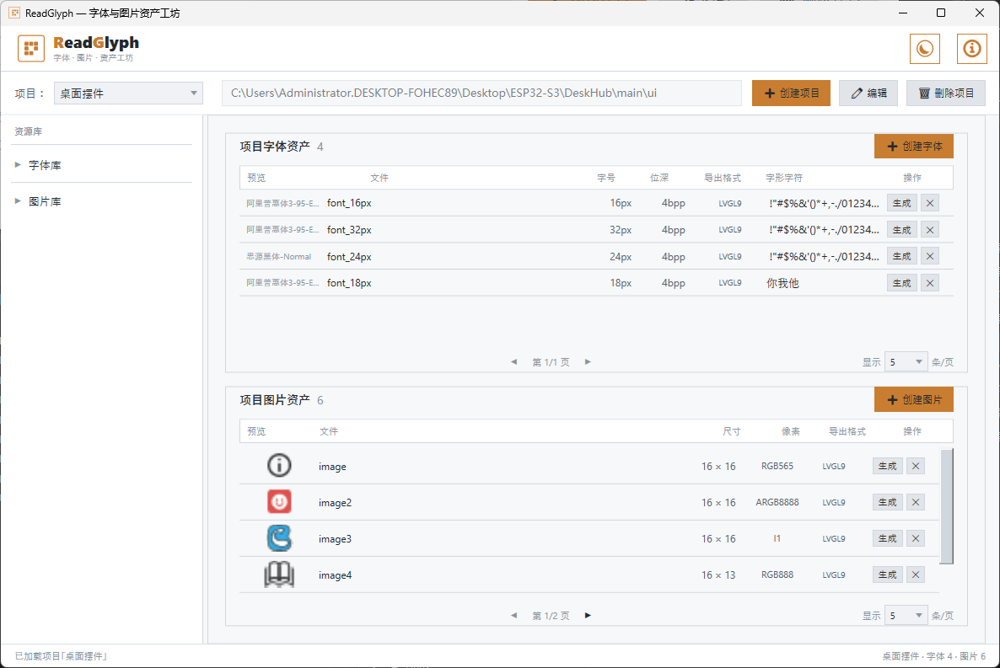

# ReadGlyph — 字体与图片资产工坊

为 **LVGL** 嵌入式 GUI 开发者打造的桌面工具，将 TTF 字体和 PNG 图片一键转换为嵌入式 C 数组文件。

---

## 核心思路

传统取模流程：找在线工具 → 上传字体/图片 → 调参数 → 下载 .c → 手动放进工程 → 改名字 → 发现缺字重新来。反复折腾。

ReadGlyph 把这件事变成：**导入一次源文件（字体文件或图片），反复调整参数点"生成"，.c 直接到位。**

---

## 双层架构

| 层级 | 存储位置 | 内容 | 特点 |
|:---|:---|:---|:---|
| **资源库** | `%AppData%/ReadGlyph/` | TTF 字体源、PNG 图片源 | 全局共享，所有项目复用 |
| **项目资产** | 用户指定的 LVGL 工程目录 | 生成的 `.c` / `.h` 文件 | 每个项目独立，.c 直接到位 |

一个字体源（如 `AlibabaPuHuiTi-3.ttf`）可以在"智能手表"项目生成 16px 字体，在"温控器"项目生成 24px 字体——源文件只存一份，资产各自独立。

---

## 快速开始

1. **创建项目** — 点击「➕ 创建项目」，填写项目名和 LVGL 工程下的ui文件夹路径
2. **导入字体源** — 在左侧"字体库"悬停时点击 `+`，选择你的 `.ttf` 文件
3. **导入图片源** — 在左侧"图片库"悬停时点击 `+`，选择你的 `.png` 文件
4. **创建字体资产** — 点击「➕ 创建字体」，选源、设字号和字符集，默认在LVGL 工程下的ui下创建fonts文件夹
5. **创建图片资产** — 点击「➕ 创建图片」，选源和像素格式，默认在LVGL 工程下的ui下创建images文件夹
6. **生成** — 点击每行的「生成」按钮，.c 文件直接写入你的 LVGL 工程目录，可直接覆盖已有的文件

> 字符集可反复修改——点击"字形字符"列的文字即可编辑，改完重新点"生成"。

---

## 免责声明

本工具为个人开发，不保证完全无缺陷。使用前请自行评估风险并备份工程文件，开发者不对使用过程中产生的任何数据丢失或功能异常承担责任。

---

## 更新记录

### v1.0.0 — 首个版本

支持项目管理、TTF 字体与 PNG 图片导入取模、LVGL v9.x格式 C 代码生成。

