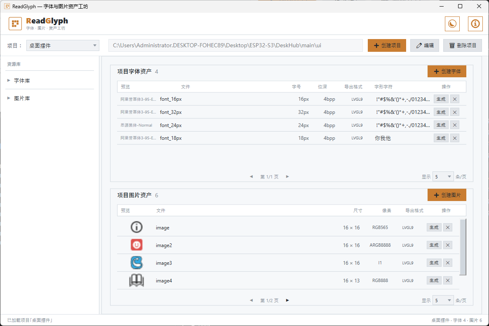

# ReadGlyph — 字体与图片资产工坊

为 **LVGL** 嵌入式 GUI 开发者打造的桌面工具，将 TTF 字体和 PNG 图片一键转换为嵌入式 C 数组文件。

---

## 核心思路

传统取模流程：找在线工具 → 上传字体/图片 → 调参数 → 下载 .c → 手动放进工程 → 改名字 → 发现缺字重新来。反复折腾。

ReadGlyph 把这件事变成：**导入一次源文件（字体文件或图片），反复调整参数点"生成"，.c 直接到位。**

---

## 双层架构

| 层级 | 存储位置 | 内容 | 特点 |
|:---|:---|:---|:---|
| **资源库** | `%AppData%/ReadGlyph/` | TTF 字体源、PNG 图片源 | 全局共享，所有项目复用 |
| **项目资产** | 用户指定的 LVGL 工程目录 | 生成的 `.c` 文件 | 每个项目独立，.c 直接到位 |

一个字体源（如 `AlibabaPuHuiTi-3.ttf`）可以在"智能手表"项目生成 16px 字体，在"温控器"项目生成 24px 字体——源文件只存一份，资产各自独立。

---

## 环境要求

- 仅支持 **Windows x64**（WPF 桌面应用）：Windows 10 1607 及以上；不支持 macOS / Linux
- 需安装 **.NET 10 桌面运行时**（[下载](https://dotnet.microsoft.com/download/dotnet/10.0)）

> ARM64 Windows 设备（如 Surface Pro X）可借助系统 x64 模拟层运行。

---

## 快速开始

1. **创建项目** — 点击「➕ 创建项目」，填写项目名和 LVGL 工程下的ui文件夹路径
2. **导入字体源** — 在左侧"字体库"悬停时点击 `+`，选择你的 `.ttf` 文件
3. **导入图片源** — 在左侧"图片库"悬停时点击 `+`，选择你的 `.png` 文件
4. **创建字体资产** — 点击「➕ 创建字体」，选源、设字号和字符集，默认在LVGL 工程下的ui下创建fonts文件夹
5. **创建图片资产** — 点击「➕ 创建图片」，选源和像素格式，默认在LVGL 工程下的ui下创建images文件夹
6. **生成** — 点击每行的「生成」按钮，.c 文件直接写入你的 LVGL 工程目录，可直接覆盖已有的文件

> 字符集可反复修改——点击"字形字符"列的文字即可编辑，改完重新点"生成"。

---

## 免责声明

本工具为个人开发，不保证完全无缺陷。使用前请自行评估风险并备份工程文件，开发者不对使用过程中产生的任何数据丢失或功能异常承担责任。

---

## 更新记录

> **版本号说明**：采用 `主版本.次版本.修订号` 规则。主版本：架构大改或不兼容变更；次版本：新增功能；修订号：缺陷修复。
>
> **发布节奏**：Release 的发布通常滞后于程序实际版本迭代，具体以本页更新记录为准。如需使用最新版本，可直接下载源码自行编译。

### v1.2.0（2026-08-30）

- 新增"编辑字形字符集"对话框的**去重**按钮：一键检测并清理重复字符，确认后自动保存字符集（不触发重新生成）
- 优化去重交互：确认前不修改输入框、支持取消，无重复字符时给出提示
- 完善生成的 .c 文件头部注释：增加工具版本号、源文件路径、LVGL 目标版本、生成时间，信息分行展示
- 生成的 .c 文件内部注释统一为英文
- 修正字体资产表格列宽与表头不一致的缺陷
- 编辑字形字符集输入框字号调小，一屏可见更多字符
- 字体资产创建对话框默认字号调整为 14px，输出文件名同步更新
- 图片资产创建对话框颜色格式默认改为 I1（一位单色），优先推荐单色图标取模

### v1.1.5（2026-08-30）

- 修正生成字体时提示“试图加载格式不正确的程序”（0x8007000B）的缺陷（32 位 FreeType 库被复制到 exe 目录，与 x64 程序架构冲突）
- 构建流程自动用 64 位 freetype6.dll 覆盖输出目录，防止重新构建或升级依赖后复发

### v1.1.4（2026-08-28）

- 更新 SixLabors.ImageSharp 到 3.1.12（修复已知漏洞）

### v1.1.3（2026-08-28）

- 修正字形位图数据错位导致渲染歪斜的缺陷（FreeType bitmap Pitch 与 Width 不一致时未逐行拷贝）
- 修正字形显示不全/错位的缺陷（ofs_y / base_line / line_height 计算对齐 LVGL lv_draw_label.c 渲染公式）
- descent 钳位到 <= 0，防止纯上升字符（数字/大写）生成后被截断

### v1.1.2（2026-08-27）

- 修正生成字体/图片资产时程序崩溃退出的缺陷（原生库异常未捕获）
- 新增全局异常捕获，防止 FreeType 等原生库异常导致应用闪退
- 修正创建资产后生成失败时资产仍残留在项目中的缺陷（失败自动回滚）
- 修正编辑字形后重新生成失败时字形修改仍被保存的缺陷（失败自动回滚）
- 优化可变字体（Variable Font）的错误提示，引导用户转换为静态字体

### v1.1.1（2026-07-09）

- 修正输出文件名填**中文/非法字符**时未被拦截、生成的 `.c` 编译报错的缺陷

### v1.1.0（2026-07-09）

- 图片资产颜色格式默认改为 **RGB565**（更贴合多数 MCU 屏帧缓冲，省 Flash）
- 新增索引色格式 **I2（4色）/ I4（16色）/ I8（256色）**，图标取模更省空间
- 修正 **I1** 索引图缺少调色板（LVGL v9 规定调色板需置于数据开头）的缺陷

### v1.0.0（2026-06-30）— 首个版本

支持项目管理、TTF 字体与 PNG 图片导入取模、LVGL v9.x格式 C 代码生成。

